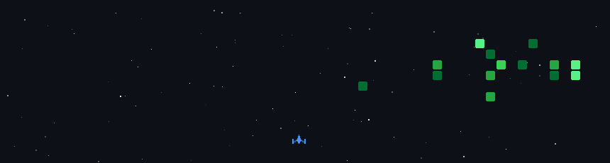

<div align="center">

<!-- Top Banner Video GIF -->


<br><br>


<br>

_+Dhafa+Achmad+Ghifari" alt="Typing SVG" />

</div>

<br>

<!-- About Terminal Box -->
<table width="100%" style="border: 4px solid #000; border-collapse: collapse; background:#FFDE59;">
<tr>
<td style="padding: 18px;">

```
┌───────────────────────────────────────────────────────────┐
│  root@dhxaep:~$ cat about.txt                             │
├───────────────────────────────────────────────────────────┤
│  > Name       : Dhafa Achmad Ghifari                      │
│  > Role       : Independent Developer & Bot Architect    │
│  > Education  : S1 Informatika - UPN "Veteran" Jakarta    │
│  > Field      : Software Engineering, AI & CyberSec       │
│  > Status     : Building & Experimenting 24/7             │
└───────────────────────────────────────────────────────────┘
```

</td>
</tr>
</table>

<br>

## `>` STACK.exe

<div align="center">


</div>

<br>

## `>` CURRENTLY_RUNNING.log

<table width="100%" style="border-collapse: collapse;">
<tr>
<td width="65%" valign="top" style="border: 4px solid #000; padding: 18px; background:#7DE2FC;">

### ⚡ Artemis & Sherlock Bot Ecosystem
Telegram & WhatsApp multi-bot deployment on Pterodactyl via PM2. Features in-game economy systems, pet/gacha mechanics, canvas-rendered games (Three Card Monte w/ anti-cheat, Monopoly clone), and AI-powered receipt scanning.

<br>

### 🛠️ DHTools
Vanilla JS multi-feature web toolkit — UTBK practice interactive mini-games + media downloader tools.  
👉 [`dhgfrtools.netlify.app`](https://dhgfrtools.netlify.app)

<br>

### 🔒 Hematin `[building in the dark]`
`> visibility: private`  
`> status: cooking`

</td>
<td width="35%" valign="middle" align="center" style="border: 4px solid #000; padding: 12px; background:#FF6B6B;">


</td>
</tr>
</table>

<br>

## `>` STATS.bin

<div align="center">


<br>


</div>

<br>

## `>` PLAY.gif — contribution graph game

<div align="center">

<!--START_SECTION:space-shooter-->

<!--END_SECTION:space-shooter-->

<br>

<sub>generated by <a href="https://github.com/czl9707/gh-space-shooter">gh-space-shooter</a> — auto-updates daily via GitHub Action</sub>

</div>

<br>

## `>` CONNECT.sh

<div align="center">

<a href="https://t.me/dhgfr_"></a>
<a href="https://portofolio.dhgfr.my.id"></a>

</div>

<br>

<div align="center">


<br>

<sub>`> connection terminated_`</sub>

</div>
